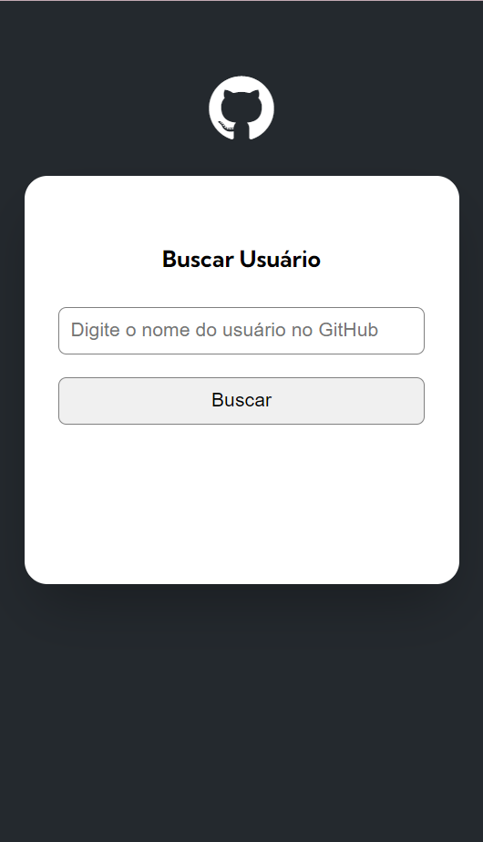
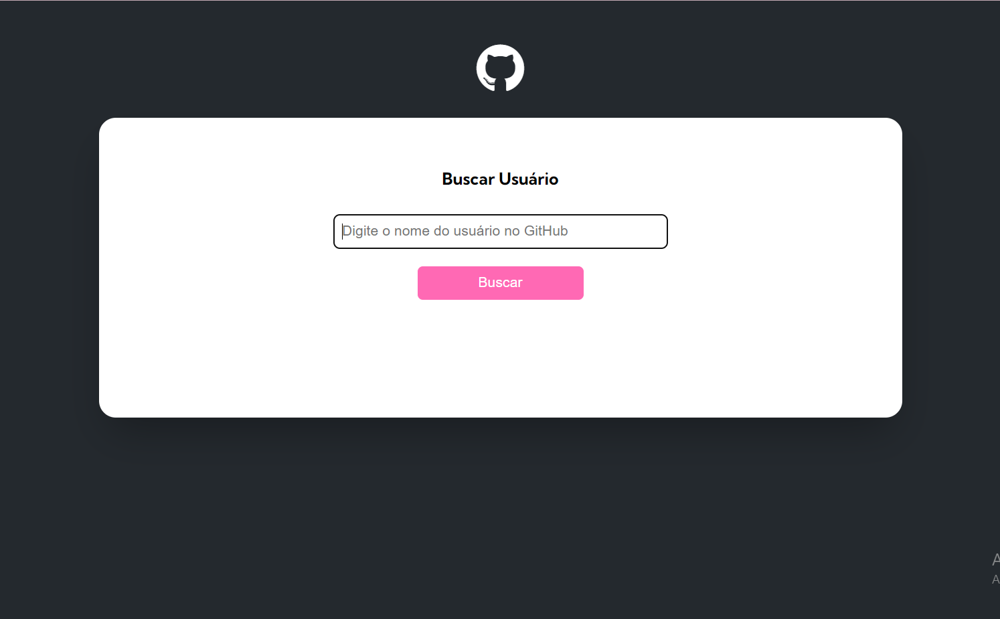

# Projeto GitHub API
Projeto realizado em uma quest no curso Dev Quester

## Objetivos:
- Pesquisar o usuário pela API do GitHub
- Mostrar a estilização do usuário - foto, nome, descrição e repositórios
- Aviso é exibido na tela sempre que o usuário não for encontrado ou não for pesquisado na barra de pesquisa.

## Dificuldades:
- Criação de pastas para organização melhor do código
- No código, permitir que a pessoa envie o nome de usuário ao pressionar a tecla "Enter"

## Tecnologias

- HTML
- CSS
- JS

## Screenshots

### Desktop

### Mobile

### Status - Desktop

